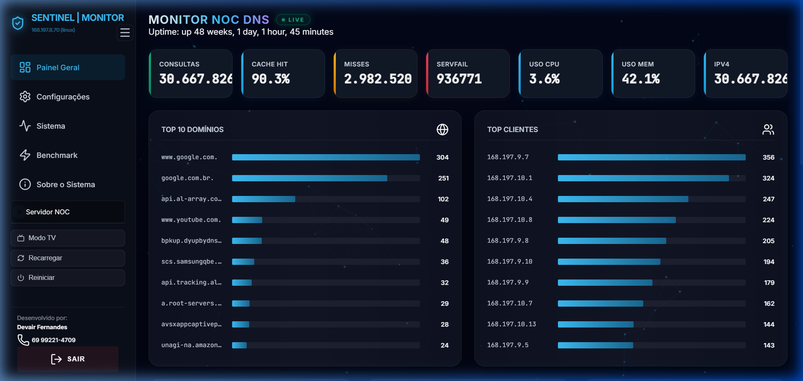
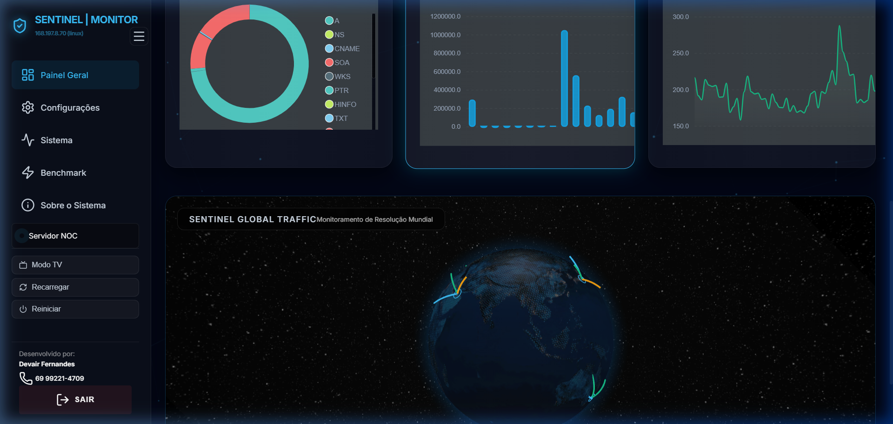

# 🛡️ Unbound Sentinel

**Appliance de DNS Recursivo & Plataforma CTI/NOC Telemetry**

Unbound Sentinel é um appliance de alto desempenho e segurança baseado em **Rocky Linux 9.7 Minimal**, projetado para automatizar e otimizar a implantação de servidores DNS recursivos em provedores de internet (ISPs), operadoras e infraestruturas corporativas críticas.

O projeto é distribuído exclusivamente como um **Appliance Autoinstalável (ISO Remasterizada)**, pronto para produção em menos de 5 minutos, operando 100% em modo offline (sem necessidade de conexão externa durante a instalação).

👉 **[Acesse o Site Oficial para Baixar a ISO](https://dns.sentineldns.uk/)**

---

## 💿 Recursos Nativos do Appliance

*   **Instalação 100% Autônoma (Unattended Kickstart)**: O instalador via Kickstart (`ks.cfg`) automatiza o particionamento de disco LVM (com isolamento de logs), a instalação das dependências (Node.js, Redis, Unbound) e inicialização do painel Sentinel sem qualquer intervenção humana.
*   **Dynamic OS & Services Auto-Tuning**: Um script inteligente monitora o hardware físico (processador e memória RAM) a cada boot e ajusta:
    *   **Buffers UDP do Kernel Linux** (`rmem_max` e `rmem_default`) para até **16MB** para evitar perdas de pacotes UDP.
    *   **Slabs de Cache (Potência de 2)** correspondentes ao número de núcleos de CPU para evitar travas em memória.
    *   **Limites de Cache** dinamicamente escalados até 4GB de RAM.
*   **RFC 8767 (Serve-Expired) & Prefetch**: Resiliência extrema. Renova domínios quentes automaticamente em background. Caso os servidores mundiais estejam indisponíveis, o Sentinel continua respondendo com registros expirados do cache por até **24 horas**.
*   **RFC 7706 (Hyperlocal)**: Resolução de servidores raiz em **0 milissegundos** rodando uma zona raiz local offline de forma segura.
*   **DNSSEC Ativo de Fábrica**: Validação criptográfica de ponta a ponta ativa por padrão.
*   **Persistência de Cache Quente**: Mapeamento dinâmico que grava o cache em disco no shutdown e restaura para a RAM no startup, evitando lentidão pós-reboots.
*   **Hardening de Segurança**: Porta SSH customizada por padrão, bloqueio de porta 22 e regras de firewall agressivas pré-configuradas.

---

## 📊 O Painel de Controle Sentinel

A ISO inclui uma interface web premium para monitoramento em tempo real:
*   **Globo 3D Holográfico (Three.js)**: Exibe arcos tridimensionais geolocalizados em tempo real conectando as ameaças locais de seus clientes aos destinos mundiais.
*   **Threat Parser (CTI)**: Motor assíncrono que processa logs de queries do Unbound filtrando logs de DNSSEC inválidos (*Bogus*) e malware.
*   **NOC Telemetry Elite (Ping Master)**: Gráficos de área néon reativos medindo perda de pacotes, jitter de rede e latências médias via ICMP/TCP.
*   **Gestão de Configuração DNS**: Editor visual seguro integrado para gerenciar zonas estáticas e arquivos de controle do Unbound.

| Painel Principal | Globo 3D de Tráfego CTI |
|:---:|:---:|
|  |  |

---

## 💻 Dimensionamento Recomendado

| Perfil de Rede | Clientes Ativos | Processador (CPU) | Memória RAM | Disco (SSD/NVMe) |
| :--- | :---: | :---: | :---: | :---: |
| **Pequeno (Rede Local / PME)** | Até 5.000 | 2 a 4 vCPUs | 4 GB a 8 GB | 30 GB SSD |
| **Médio (Provedor Médio / ISP)** | 5.000 a 20.000 | 4 a 8 Cores (Físicos) | 8 GB a 16 GB | 60 GB NVMe |
| **Elite (Alto Tráfego)** | Acima de 20.000 | 8 a 16 Cores (Físicos) | 16 GB a 32 GB | 100 GB Enterprise |

---

## 📞 Licenciamento, Suporte e Parcerias

O Unbound Sentinel é uma solução proprietária/comercial. Oferecemos suporte premium e consultoria avançada em engenharia de DNS recursivo.

Para adquirir licenças corporativas ou suporte de integração:
*   **Site Oficial:** [dns.sentineldns.uk](https://dns.sentineldns.uk/)
*   **Contato Oficial:** [Conversar via WhatsApp com a Equipe Sentinel](https://wa.me/5569992214709)

---

# 🛡️ Unbound Sentinel (English)

**Recursive DNS Appliance & CTI/NOC Telemetry Platform**

Unbound Sentinel is a high-performance, secure DNS recursion appliance based on **Rocky Linux 9.7 Minimal**, designed to automate and optimize DNS resolution in Internet Service Providers (ISPs), telecom operators, and critical corporate networks.

The project is distributed as a **Self-Installing ISO Image (Remastered Appliance)**, ready for production in under 5 minutes, operating 100% offline (no external internet required during installation).

👉 **[Go to Official Website to Download the ISO](https://dns.sentineldns.uk/)**

---

## 💿 Appliance Features

*   **100% Unattended Installation (Kickstart)**: Automatically partitions disks (LVM with log isolation), installs dependencies (Node.js, Redis, Unbound), and configures the dashboard with zero human intervention.
*   **Dynamic OS & Services Auto-Tuning**: A startup script calculates system memory/CPU cores and configures:
    *   **Linux Kernel UDP Buffers** up to **16MB** (`rmem_max` and `rmem_default`) to prevent UDP packet loss.
    *   **Cache Slabs (Power of 2)** mapped to CPU cores for lock-less memory access.
    *   **Cache Limits** dynamically scaled up to 4GB RAM.
*   **RFC 8767 (Serve-Expired) & Prefetch**: Extreme uptime. Automatically prefetches popular domains. If authoritative root servers go offline or suffer DDoS attacks, Sentinel serves cached records for up to **24 hours**.
*   **RFC 7706 (Hyperlocal)**: Offline local root servers resolution in **0 milliseconds**.
*   **Out-of-the-box DNSSEC**: End-to-end cryptographic signatures validation active by default.
*   **Persistent Cache**: Systemd hooks to dump RAM cache to disk on shutdown and reload it on startup, eliminating slow query performance after rebooting.

---

## 📞 Licensing and Commercial Support

Unbound Sentinel is proprietary software. We offer premium corporate support and DNS resolution consultancy.

*   **Official Website:** [dns.sentineldns.uk](https://dns.sentineldns.uk/)
*   **WhatsApp Support:** [Contact Sentinel Team](https://wa.me/5569992214709)

---

*© 2026 Unbound Sentinel — Advanced Engineering and DNS Intelligence.*
